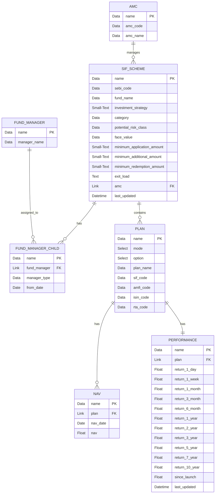

for confirmation

```mermaid
erDiagram

    AMC ||--o{ SIF_SCHEME : manages
    SIF_SCHEME ||--o{ FUND_MANAGER_CHILD : has
    FUND_MANAGER ||--o{ FUND_MANAGER_CHILD : assigned_to

    SIF_SCHEME ||--o{ PLAN : contains
    PLAN ||--o{ NAV : has
    PLAN ||--|| PERFORMANCE : has


    AMC {
        Data name PK
        Data amc_code
        Data amc_name
    }

    FUND_MANAGER {
        Data name PK
        Data manager_name
    }

    FUND_MANAGER_CHILD {
        Data name PK
        Link fund_manager FK
        Data manager_type
        Date from_date
    }

    SIF_SCHEME {
        Data name PK
        Data sebi_code
        Data fund_name
        Small-Text investment_strategy
        Data category
        Data potential_risk_class
        Data face_value

        Small-Text minimum_application_amount
        Small-Text minimum_additional_amount
        Small-Text minimum_redemption_amount

        Text exit_load

        Link amc FK

        Datetime last_updated
    }

    PLAN {
        Data name PK

        Select mode
        Select option

        Data plan_name
        Data sif_code
        Data amfi_code
        Data isin_code
        Data rta_code
    }

    NAV {
        Data name PK

        Link plan FK

        Date nav_date
        Float nav
    }

    PERFORMANCE {
        Data name PK

        Link plan FK

        Float return_1_day
        Float return_1_week
        Float return_1_month
        Float return_3_month
        Float return_6_month
        Float return_1_year
        Float return_2_year
        Float return_3_year
        Float return_5_year
        Float return_7_year
        Float return_10_year
        Float since_launch

        Datetime last_updated
    }
```