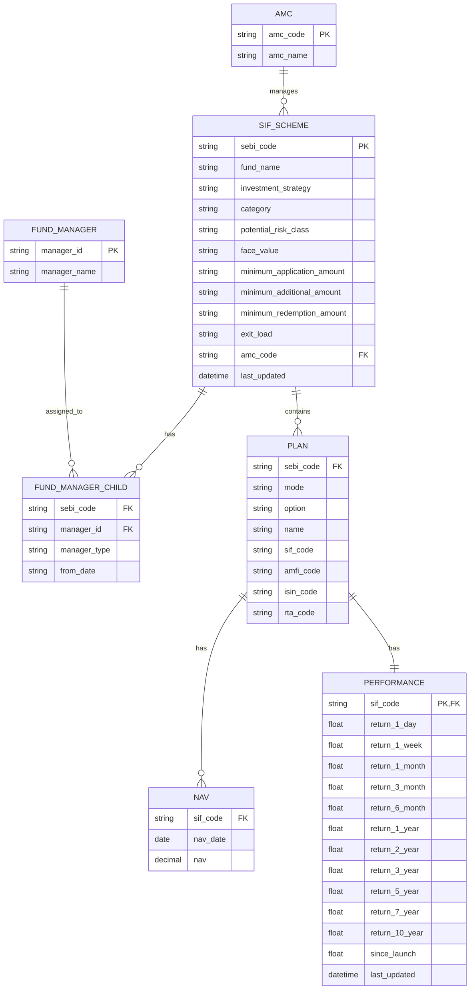

for confirmation

```mermaid
erDiagram

    AMC ||--o{ SIF_SCHEME : manages
    SIF_SCHEME ||--o{ FUND_MANAGER_CHILD : has
    FUND_MANAGER ||--o{ FUND_MANAGER_CHILD : assigned_to

    SIF_SCHEME ||--o{ PLAN : contains
    PLAN ||--o{ NAV : has
    PLAN ||--|| PERFORMANCE : has


    AMC {
        string amc_code PK
        string amc_name
    }

    FUND_MANAGER {
        string manager_id PK
        string manager_name
    }

    FUND_MANAGER_CHILD {
        string sebi_code FK
        string manager_id FK

        string manager_type
        string from_date
    }

    SIF_SCHEME {
        string sebi_code PK

        string fund_name
        string investment_strategy
        string category
        string potential_risk_class

        string face_value

        string minimum_application_amount
        string minimum_additional_amount
        string minimum_redemption_amount

        string exit_load

        string amc_code FK

        datetime last_updated
    }

    PLAN {
        string sebi_code FK

        string mode
        string option
        string name

        string sif_code
        string amfi_code
        string isin_code
        string rta_code
    }

    NAV {
        string sif_code FK

        date nav_date
        decimal nav
    }

    PERFORMANCE {
        string sif_code PK,FK

        float return_1_day
        float return_1_week
        float return_1_month
        float return_3_month
        float return_6_month
        float return_1_year
        float return_2_year
        float return_3_year
        float return_5_year
        float return_7_year
        float return_10_year
        float since_launch

        datetime last_updated
    }
```