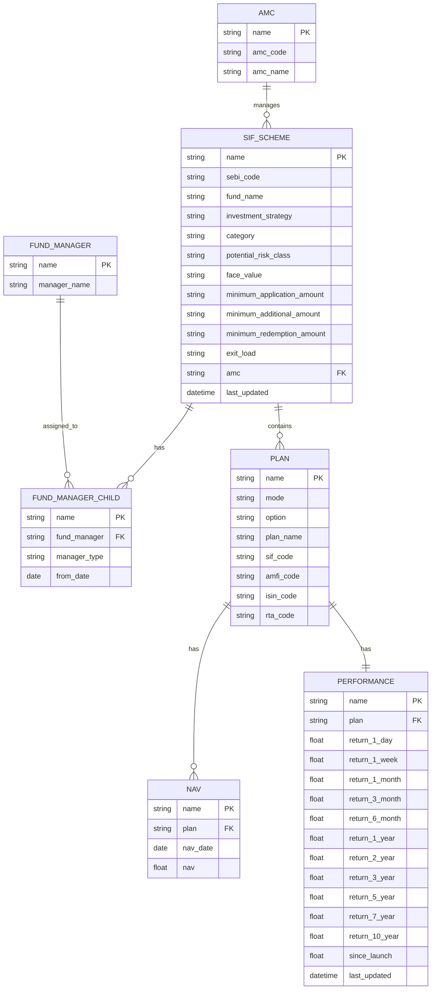

for confirmation

```mermaid
erDiagram

    AMC ||--o{ SIF_SCHEME : manages
    SIF_SCHEME ||--o{ FUND_MANAGER_CHILD : has
    FUND_MANAGER ||--o{ FUND_MANAGER_CHILD : assigned_to

    SIF_SCHEME ||--o{ PLAN : contains
    PLAN ||--o{ NAV : has
    PLAN ||--|| PERFORMANCE : has


    AMC {
        string name PK
        string amc_code
        string amc_name
    }

    FUND_MANAGER {
        string name PK
        string manager_name
    }

    FUND_MANAGER_CHILD {
        string name PK
        string fund_manager FK
        string manager_type
        date from_date
    }

    SIF_SCHEME {
        string name PK
        string sebi_code
        string fund_name
        string investment_strategy
        string category
        string potential_risk_class
        string face_value
        string minimum_application_amount
        string minimum_additional_amount
        string minimum_redemption_amount
        string exit_load
        string amc FK
        datetime last_updated
    }

    PLAN {
        string name PK
        string mode
        string option
        string plan_name
        string sif_code
        string amfi_code
        string isin_code
        string rta_code
    }

    NAV {
        string name PK
        string plan FK
        date nav_date
        float nav
    }

    PERFORMANCE {
        string name PK
        string plan FK
        float return_1_day
        float return_1_week
        float return_1_month
        float return_3_month
        float return_6_month
        float return_1_year
        float return_2_year
        float return_3_year
        float return_5_year
        float return_7_year
        float return_10_year
        float since_launch
        datetime last_updated
    }
```