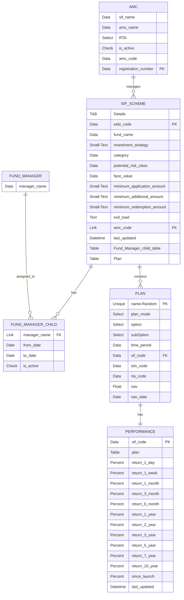

for confirmation

```mermaid
erDiagram

    AMC ||--o{ SIF_SCHEME : manages
    SIF_SCHEME ||--o{ FUND_MANAGER_CHILD : has
    FUND_MANAGER ||--o{ FUND_MANAGER_CHILD : assigned_to

    SIF_SCHEME ||--o{ PLAN : contains
    PLAN ||--|| PERFORMANCE : has


    AMC {
        Data sif_name 
        Data amc_name 
        Select RTA 
        Check is_active 
        Data amc_code 
        Data registration_number PK

    }

    FUND_MANAGER {
        Data manager_name
    }

    FUND_MANAGER_CHILD {
        Link manager_name FK
        Date from_date 
        Date to_date 
        Check is_active 
    }

    SIF_SCHEME {
        TAB Details 
        Data sebi_code PK   
        Data fund_name
        Small-Text investment_strategy
        Data category
        Data potential_risk_class
        Data face_value

        Small-Text minimum_application_amount
        Small-Text minimum_additional_amount
        Small-Text minimum_redemption_amount

        Text exit_load

        Link amc_code FK

        Datetime last_updated

        Table Fund_Manager_child_table
        Table Plan
    }

    PLAN {
        Unique name-Random PK

        Select plan_mode
        Select option
        Select subOption
        Data time_period

        Data sif_code FK
        Data isin_code
        Data rta_code
        Float nav
        Date nav_date
    }

    PERFORMANCE {
        Data sif_code PK

        Table plan 

        Percent return_1_day
        Percent return_1_week
        Percent return_1_month
        Percent return_3_month
        Percent return_6_month
        Percent return_1_year
        Percent return_2_year
        Percent return_3_year
        Percent return_5_year
        Percent return_7_year
        Percent return_10_year
        Percent since_launch

        Datetime last_updated
    }
```
